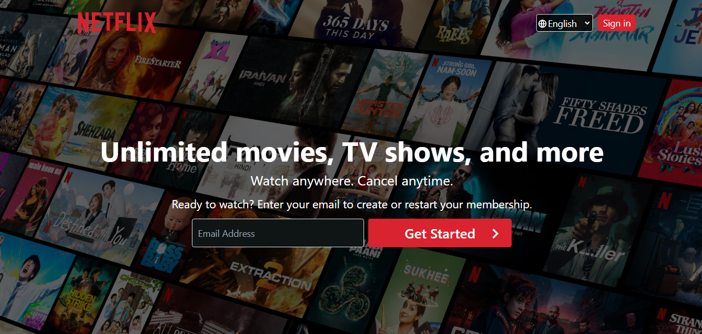

# Netflix Clone

A Netflix clone created using HTML, Tailwind CSS, and JavaScript.

## Table of Contents
- [Features](#features)
- [Installation](#installation)
- [Contributing](#contributing)
- [License](#license)

## Features
- Responsive design
- Tailwind CSS styling
- Netflix-like sections and layout
- Frequently Asked Questions section with toggle functionality

## Installation
1. Clone the repository: `git clone https://github.com/MuhammadAmmarAtique/Netflix_Clone
2. Change into the project directory: `cd netflix-clone`
3. Open `index.html` in your preferred browser.

## Contributing
If you'd like to contribute to this project, please follow these guidelines:
1. Fork the project.
2. Create your feature branch: `git checkout -b feature/your-feature`
3. Commit your changes: `git commit -m 'Add some feature'`
4. Push to the branch: `git push origin feature/your-feature`
5. Open a pull request.

## License
This project is licensed under the [MIT License](LICENSE).

---

Feel free to customize this template based on your project's specific details. Good luck with your Netflix clone, and happy coding!
